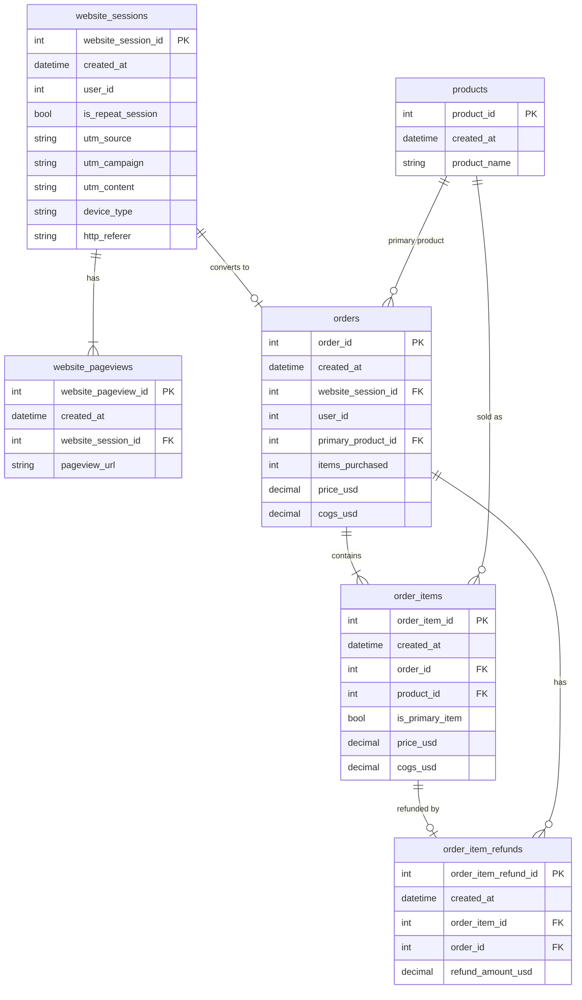

# Toy Store — Tables & Relationships

Source: Maven Analytics "Maven Fuzzy Factory" dataset (`toy-store/data/`).
An online toy retailer's website traffic and e‑commerce data, **2012‑03‑19 → 2015‑03‑19**
(refunds run to 2015‑04‑01).

## Entity–relationship diagram



Text version:

```
products (4) ─────────────┬──────────────< order_items (40,025) ──< order_item_refunds (1,731)
      │ primary_product_id │                    │ order_id                 │ order_id
      ▼                    │                    ▼                          ▼
      └──────────────────> orders (32,313) <────┴──────────────────────────┘
                              │ website_session_id (1 : 0..1)
                              ▼
                     website_sessions (472,871) ──< website_pageviews (1,188,124)
```

## Tables

| Table | Rows | Grain (one row per…) | Primary key |
|---|---:|---|---|
| `products` | 4 | product | `product_id` |
| `website_sessions` | 472,871 | website visit | `website_session_id` |
| `website_pageviews` | 1,188,124 | page viewed within a session | `website_pageview_id` |
| `orders` | 32,313 | order (checkout) | `order_id` |
| `order_items` | 40,025 | product line within an order | `order_item_id` |
| `order_item_refunds` | 1,731 | refunded order item | `order_item_refund_id` |
| `maven_fuzzy_factory_data_dictionary` | 36 | field description (metadata only) | `Table` + `Field` |

### products
| Field | Type | Description |
|---|---|---|
| `product_id` | int, PK | 1–4 |
| `created_at` | datetime | Product launch date |
| `product_name` | text | Product name |

| id | Product | Launched | Price | COGS |
|---|---|---|---:|---:|
| 1 | The Original Mr. Fuzzy | 2012‑03‑19 | $49.99 | $19.49 |
| 2 | The Forever Love Bear | 2013‑01‑06 | $59.99 | $22.49 |
| 3 | The Birthday Sugar Panda | 2013‑12‑12 | $45.99 | $14.49 |
| 4 | The Hudson River Mini bear | 2014‑02‑05 | $29.99 | $9.49 |

Price and COGS come from `order_items` and are constant per product across the whole period.

### website_sessions
| Field | Type | Description |
|---|---|---|
| `website_session_id` | int, PK | Session identifier |
| `created_at` | datetime | Session start (equals the first pageview's timestamp) |
| `user_id` | int | Visitor ID (394,318 distinct users; no users table exists) |
| `is_repeat_session` | 0/1 | 1 if the user had a previous session |
| `utm_source` | text | `gsearch`, `bsearch`, `socialbook`, or `NULL` |
| `utm_campaign` | text | `nonbrand`, `brand`, `pilot`, `desktop_targeted`, or `NULL` |
| `utm_content` | text | Ad variant: `g_ad_1`, `g_ad_2`, `b_ad_1`, `b_ad_2`, `social_ad_1`, `social_ad_2`, or `NULL` |
| `device_type` | text | `desktop` or `mobile` |
| `http_referer` | text | Referring domain, or `NULL` |

> `NULL` is stored as the **literal string** `NULL` in the CSV.

### website_pageviews
| Field | Type | Description |
|---|---|---|
| `website_pageview_id` | int, PK | Pageview identifier (increases over time) |
| `created_at` | datetime | Pageview timestamp (quoted in the CSV) |
| `website_session_id` | int, FK → `website_sessions` | Owning session |
| `pageview_url` | text | Page path (see the funnel below) |

### orders
| Field | Type | Description |
|---|---|---|
| `order_id` | int, PK | Order identifier |
| `created_at` | datetime | Order timestamp |
| `website_session_id` | int, FK → `website_sessions` | Session in which the order was placed |
| `user_id` | int | Same value as the session's `user_id` |
| `primary_product_id` | int, FK → `products` | First product added to the cart |
| `items_purchased` | int | 1 or 2 (24,601 single‑item orders, 7,712 two‑item orders) |
| `price_usd` | decimal | Order revenue (sum of item prices) |
| `cogs_usd` | decimal | Order cost of goods (sum of item COGS) |

### order_items
| Field | Type | Description |
|---|---|---|
| `order_item_id` | int, PK | Line identifier |
| `created_at` | datetime | Same as the order's `created_at` |
| `order_id` | int, FK → `orders` | Parent order |
| `product_id` | int, FK → `products` | Product sold |
| `is_primary_item` | 0/1 | 1 = the order's primary product; 0 = cross‑sell/add‑on |
| `price_usd` | decimal | Item price |
| `cogs_usd` | decimal | Item COGS |

### order_item_refunds
| Field | Type | Description |
|---|---|---|
| `order_item_refund_id` | int, PK | Refund identifier |
| `created_at` | datetime | Refund timestamp (2 or more days after the order) |
| `order_item_id` | int, FK → `order_items` | Refunded line (unique: at most one refund per item) |
| `order_id` | int, FK → `orders` | Denormalised parent order |
| `refund_amount_usd` | decimal | Always equals the item's `price_usd` (full refunds only) |

## Relationships

| From (many) | To (one) | Join | Cardinality | Notes |
|---|---|---|---|---|
| `website_pageviews` | `website_sessions` | `website_session_id` | N : 1 | Every session has at least one pageview. The first pageview is the **landing page**. |
| `orders` | `website_sessions` | `website_session_id` | 0..1 : 1 | At most one order per session. About 6.8% of sessions convert. |
| `order_items` | `orders` | `order_id` | N : 1 | Count equals `items_purchased`, and item prices sum to `orders.price_usd`. |
| `order_items` | `products` | `product_id` | N : 1 | |
| `orders` | `products` | `primary_product_id` | N : 1 | Matches the one item with `is_primary_item = 1`. |
| `order_item_refunds` | `order_items` | `order_item_id` | 0..1 : 1 | |
| `order_item_refunds` | `orders` | `order_id` | N : 1 | Redundant with `order_items.order_id` (always consistent). |
| `orders` / `website_sessions` | *(users)* | `user_id` | N : 1 | There's no users table. `user_id` groups the sessions of a returning visitor. |

### Integrity checks (all pass)
- There are no orphan foreign keys in any table.
- `orders.user_id` equals `website_sessions.user_id` for the order's session.
- `orders.items_purchased` equals the count of its `order_items`.
- `orders.price_usd` equals the sum of its `order_items.price_usd`. The same holds for COGS.
- Each order has exactly one primary item, and that item's product equals `orders.primary_product_id`.
- `order_items.created_at` equals `orders.created_at`.
- Refunds are unique per item and always for the full item price.
- No product is sold before its launch date.
- `website_sessions.created_at` equals the timestamp of the session's first pageview.

## Derived dimensions used by the web app

### Traffic source / channel
Derived from `utm_source`, `utm_campaign` and `http_referer`:

| utm_source | utm_campaign | http_referer | Source (app) | Channel |
|---|---|---|---|---|
| gsearch / bsearch | nonbrand | engine | gsearch / bsearch | Paid search – nonbrand |
| gsearch / bsearch | brand | engine | gsearch / bsearch | Paid search – brand |
| socialbook | pilot / desktop_targeted | socialbook | socialbook | Paid social |
| NULL | NULL | gsearch / bsearch | organic | Organic search |
| NULL | NULL | NULL | direct | Direct type‑in |

### Website funnel (from `pageview_url`)

| Step | Pages |
|---|---|
| 0. Landing | `/home`, `/lander-1` … `/lander-5` (landing‑page A/B tests) |
| 1. Products listing | `/products` |
| 2. Product page | `/the-original-mr-fuzzy`, `/the-forever-love-bear`, `/the-birthday-sugar-panda`, `/the-hudson-river-mini-bear` |
| 3. Cart | `/cart` |
| 4. Shipping | `/shipping` |
| 5. Billing | `/billing` (original) or `/billing-2` (A/B test variant) |
| 6. Order placed | `/thank-you-for-your-order` (one per order) |

### Key metrics
- **Conversion rate** = orders ÷ sessions
- **Revenue** = Σ `order_items.price_usd`. **Gross profit** = revenue − Σ `cogs_usd`.
- **AOV** (average order value) = revenue ÷ orders
- **Refund rate** = refunded items ÷ items sold
- **Bounce rate** = sessions with a single pageview ÷ sessions
- **Revenue per session** = revenue ÷ sessions
